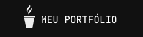

## 🚀 Sobre mim
Olá! Eu sou Dalton Gomes, desenvolvedor full-stack 👋

📚 - Estudante de Ciência da Computação (UFCA)

🎯 - Dev Full-stack

🤓 - Programo em NodeJS, TypeScript, C/C++/C#, Java e PHP

😎 - Tenho facilidade em aprender novas linguagens

⚡ - Amo tecnologia 

##

##

 

