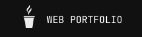

  
  

<h3 align="left">👩‍💻  About Me</h3>

###

My name is Dalton Gomes Lobato, I'm a Computer Science student at UFCA
  -  🔭 I'm a full-stack developer
 - 💻️ Currently focused on back end projects
 - 📚 I'm willing to participate in new projects and learn new things

###

<h3 align="left">🛠 Languages and Tools</h3>

###

  
  

###

<h3 align="left">🤓   My Stats</h3>

###

  

  
  

###
